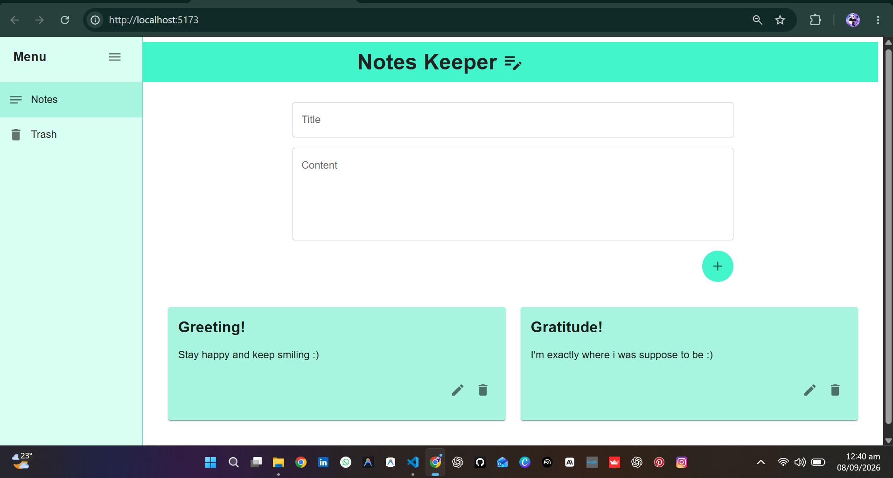

# Notes Keeper



A clean and responsive notes application inspired by the familiar note-taking experience of Google Keep. Built with React and Vite, this project focuses on a simple, modern interface for creating, editing, and organizing notes.

## Overview

Notes Keeper allows users to:

- Create new notes with a title and content
- Edit existing notes in-place
- Move notes to a trash view
- Navigate between notes and trash sections
- Enjoy a lightweight, minimal UI optimized for daily use

## Features

- Modern note card layout
- Quick note creation workflow
- Edit and delete actions
- Sidebar-based navigation
- Responsive design for desktop and smaller screens
- Fast development setup with Vite

## Tech Stack

- React
- Vite
- Material UI icons
- CSS-based styling

## Getting Started

1. Clone the repository:

```bash
git clone https://github.com/your-username/keeper-app.git
cd keeper-app
```

2. Install dependencies:

```bash
npm install
```

3. Run the development server:

```bash
npm run dev
```

4. Open the app in your browser at the local Vite URL displayed in the terminal.

## Production Build

```bash
npm run build
```

## Project Structure

```text
keeper-app/
├── public/
├── src/
├── index.html
├── package.json
├── vite.config.js
├── README.md
└── eslint.config.js
```

## License

This project is open-source and available for personal or educational use.

