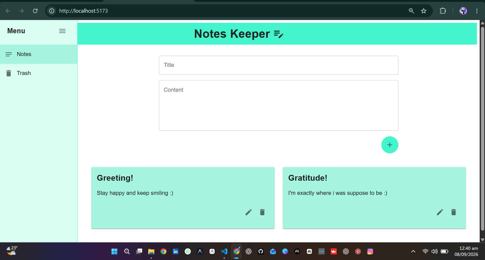

# Notes Keeper



A responsive notes app with a familiar yellow notes-inspired theme. Users can create an account, organize notes, and move unwanted notes to the trash.

## Features

- Sign up and log in
- Create and edit notes
- Move notes to the trash, restore them, or delete them permanently
- Navigate notes and trash from a responsive sidebar
- Use the app on desktop, tablet, and mobile screens

## Tech Stack

- Client: React, Vite, Material UI, Axios
- Server: Node.js, Express, Mongoose, MongoDB

## Getting Started

### Requirements

- Node.js and npm
- A MongoDB database

### Configure the database

Create a `.env` file in the repository root. The server loads this file and expects the MongoDB connection string under the variable name `MONGOO_URI`:

```env
MONGOO_URI=mongodb+srv://<username>:<password>@<cluster>/<database>?retryWrites=true&w=majority
```

The root `.env` file is ignored by Git. Keep your database credentials there and do not commit them.

### Install dependencies

Run these commands from the repository root:

```bash
npm install --prefix server
npm install --prefix client
```

### Start the app

Start the backend in one terminal:

```bash
cd server
node server.js
```

The API listens on `http://localhost:5000`. Start the frontend in a second terminal:

```bash
cd client
npm run dev
```

Open the Vite URL shown in the terminal, usually `http://localhost:5173`. The Vite development server proxies `/api` requests to the backend.

## Client Commands

Run these from the `client` directory:

```bash
npm run build
npm run preview
npm run lint
```

## Project Structure

```text
keeper-app/
├── client/
│   ├── public/
│   ├── src/
│   ├── index.html
│   ├── package.json
│   └── vite.config.js
├── server/
│   ├── auths/
│   ├── controllers/
│   ├── models/
│   ├── package.json
│   └── server.js
├── .env
└── README.md
```

